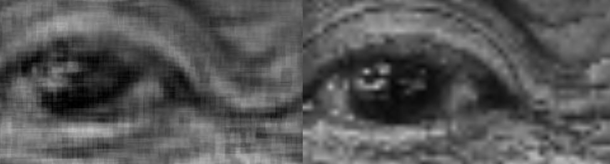
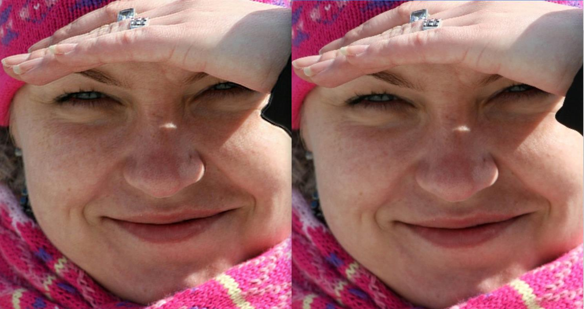

# Human-FSRCNN
Fast Super-Resolution Convolutional Neural Network for human image

In this project, we aimed to:
  1. Train a CNN model to built high resolution human image (eg: from 256*256 to 1024*41024) 
  2. Make the transform fast enough to do it in real time(20-30fps)

How to use the codes:
>Python version:
1. Create a folder 'dataset' in the main folder: Human-FSRCNN/dataset.
2. Create two sub-folder: 'Human-FSRCNN/dataset/HR_img_train', 'Human-FSRCNN/dataset/HR_img_test', and put test and train imgs in them(The original pics only, and the height and width must be the factor of 4).
3. run 'bash run.sh' in the Model folder.
>Jupyter Notebook version:
1. Create a folder 'dataset' in the main folder(eg: Human-FSRCNN/dataset).
2. Run data_generation.ipynb (generate image for training and testing)
3. Run Human_FSRCNN.ipynb (train model and test model, output high-resolution image)

## First version result:
generate 4 times large original image, create image on average time:1s, PSNR=33dB, image not clear enough, especially on edge

 <b>

   
## Second version result:

